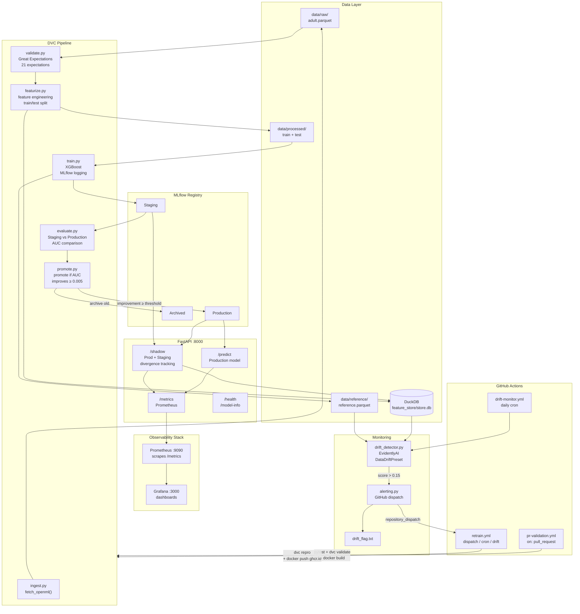

# MLOps Pipeline — Drift Detection & Self-Healing CI/CD

End-to-end MLOps portfolio project demonstrating production engineering maturity.
The ML model is intentionally simple (XGBoost on UCI Adult Income).
All complexity lives in the infrastructure.

---

## Architecture



---

## Tech Stack

| Layer | Tool |
|---|---|
| Model | XGBoost (sklearn API) |
| Data validation | Great Expectations (21 expectations) |
| Feature store | DuckDB + Parquet |
| Experiment tracking | MLflow (local) |
| Pipeline versioning | DVC |
| Serving | FastAPI + Uvicorn |
| Metrics | Prometheus + prometheus-client |
| Monitoring | Evidently AI |
| Dashboards | Grafana (self-hosted) |
| Containerisation | Docker + Docker Compose |
| CI/CD | GitHub Actions |

---

## Quick Start

### 1. Setup

```bash
git clone https://github.com/your-username/mlops-pipeline
cd mlops-pipeline

python -m venv .venv
# Windows:
.venv\Scripts\activate
# Linux/macOS:
source .venv/bin/activate

pip install -r requirements.txt
cp .env.example .env   # fill in GITHUB_TOKEN and GITHUB_REPO
```

### 2. Run the full pipeline

```bash
dvc repro
```

This runs all six stages in order:

```
ingest → validate → featurize → train → evaluate → promote
```

Or run stages individually:

```bash
python pipelines/ingest.py
python pipelines/validate.py
python pipelines/featurize.py
python pipelines/train.py
python pipelines/evaluate.py
python pipelines/promote.py
```

### 3. Bring up the full stack

```bash
docker-compose up --build
```

| Service | URL |
|---|---|
| FastAPI | http://localhost:8000 |
| MLflow UI | http://localhost:5000 |
| Prometheus | http://localhost:9090 |
| Grafana | http://localhost:3000 (admin/admin) |

### 4. Make a prediction

```bash
curl -X POST http://localhost:8000/predict \
  -H "Content-Type: application/json" \
  -d '{
    "age": 35,
    "workclass": "Private",
    "fnlwgt": 200000,
    "education": "Bachelors",
    "education_num": 13,
    "marital_status": "Married-civ-spouse",
    "occupation": "Exec-managerial",
    "relationship": "Husband",
    "race": "White",
    "sex": "Male",
    "capital_gain": 0,
    "capital_loss": 0,
    "hours_per_week": 45,
    "native_country": "United-States"
  }'
```

### 5. Shadow deployment

```bash
curl -X POST http://localhost:8000/shadow \
  -H "Content-Type: application/json" \
  -d '{ ... same payload ... }'
```

Returns the Production prediction. Staging runs silently. Divergence rate tracked in Prometheus.

---

## Self-Healing Demo

This is the money shot. Run these steps in order:

```
Step 1 — docker-compose up --build
          Bring up the entire stack

Step 2 — dvc repro
          Train initial model, promote to Production

Step 3 — curl /predict
          Confirm live inference works

Step 4 — curl /shadow
          Show shadow deployment divergence at 0%

Step 5 — python scripts/simulate_drift.py --noise-factor 0.3 --n-records 500
          Inject 500 synthetic drifted records into the inference store

Step 6 — python monitoring/drift_detector.py
          Evidently detects drift (score ~0.92 >> threshold 0.15)
          Fires GitHub repository_dispatch → triggers retrain.yml

Step 7 — retrain.yml runs automatically on GitHub Actions
          Full dvc repro: ingest → validate → featurize → train → evaluate → promote

Step 8 — New model promoted to Production
          AUC checked; if improvement ≥ 0.005, Staging → Production

Step 9 — Grafana dashboard
          Drift score drops back toward baseline
          Prediction distribution stabilises
```

**Screenshot or record steps 5–9.** This demonstrates the full feedback loop.

---

## Running Tests

```bash
pytest tests/ -v
```

51 tests across four modules:

| File | Coverage |
|---|---|
| `tests/test_validate.py` | Great Expectations suite logic |
| `tests/test_featurize.py` | Feature engineering + DuckDB API |
| `tests/test_serving.py` | All 5 FastAPI endpoints + shadow tracker |
| `tests/test_drift.py` | Drift detection + alerting |

---

## Project Structure

```
mlops-pipeline/
├── pipelines/
│   ├── ingest.py        — download UCI Adult dataset
│   ├── validate.py      — Great Expectations (21 checks)
│   ├── featurize.py     — feature engineering → DuckDB + Parquet
│   ├── train.py         — XGBoost + MLflow logging + model registry
│   ├── evaluate.py      — Staging vs Production AUC comparison
│   └── promote.py       — conditional promotion to Production
├── feature_store/
│   ├── schema.sql        — DuckDB table definitions
│   └── feature_store.py  — read/write API
├── serving/
│   ├── main.py          — FastAPI app (5 endpoints)
│   ├── predictor.py     — MLflow model loading + inference
│   ├── shadow.py        — shadow divergence tracker
│   ├── metrics.py       — Prometheus metrics definitions
│   └── Dockerfile
├── monitoring/
│   ├── drift_detector.py — Evidently drift reports
│   └── alerting.py       — GitHub dispatch on drift
├── scripts/
│   └── simulate_drift.py — inject synthetic drift for demo
├── tests/               — pytest suite (51 tests)
├── .github/workflows/   — pr-validation, retrain, drift-monitor
├── great_expectations/  — GE suite config
├── grafana/             — Grafana provisioning (datasource + dashboard)
├── prometheus/          — Prometheus scrape config
├── docker-compose.yml
├── dvc.yaml             — 6-stage pipeline DAG
├── params.yaml          — single source of truth for all config
└── requirements.txt
```

---

## Key Design Decisions

- **No Kubernetes** — Docker Compose is sufficient and easier to demo locally
- **No cloud deployment** — everything runs on localhost; Render free tier optional
- **DuckDB over Feast** — same concept, zero infrastructure overhead
- **Local MLflow** — `./mlruns` on disk; no remote tracking server needed
- **Self-hosted Grafana** — avoids Grafana Cloud 14-day data retention limit
- **XGBoost kept simple** — resist the urge to add model complexity; infra is the point

---

## Environment Variables

Copy `.env.example` to `.env` and fill in:

```bash
MLFLOW_TRACKING_URI=mlruns
DRIFT_THRESHOLD=0.15
GITHUB_TOKEN=your_token_here       # for repository_dispatch
GITHUB_REPO=your-username/mlops-pipeline
MODEL_NAME=adult_income_classifier
SHADOW_MODE=true
```

`GITHUB_TOKEN` and `GITHUB_REPO` are only needed for the self-healing dispatch.
All other functionality works without them.
